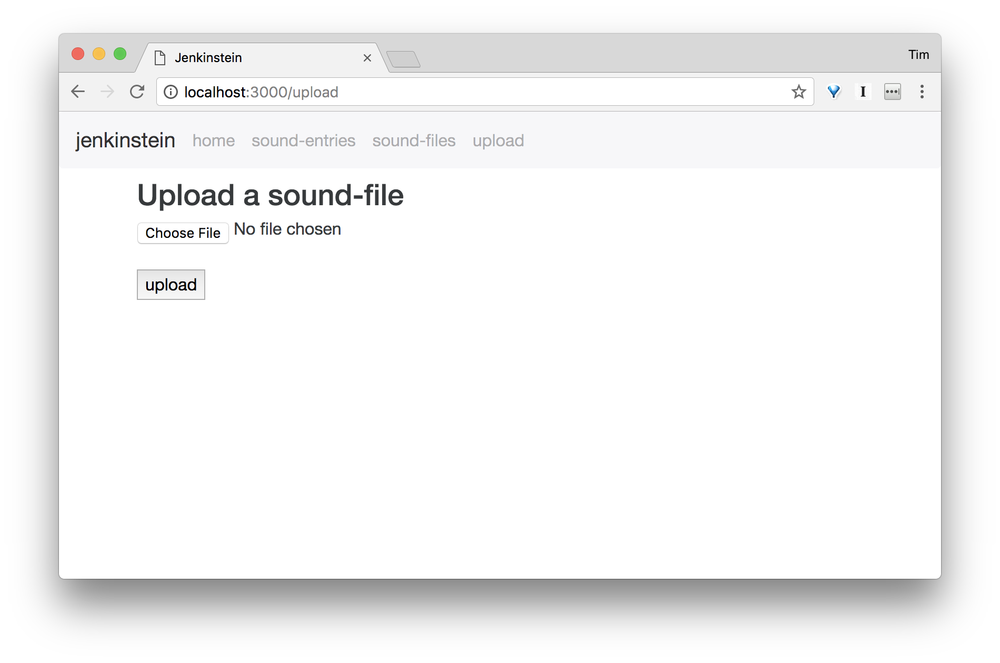
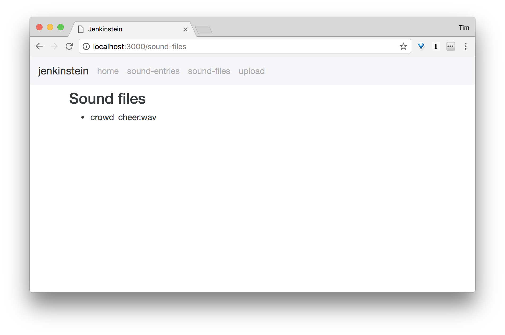
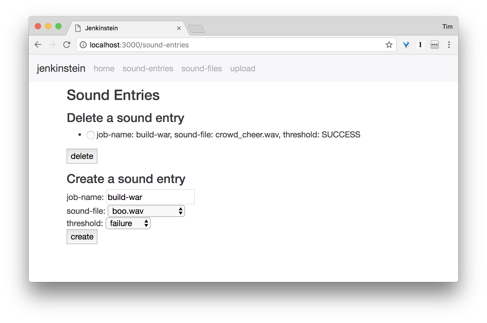

# Jenkinstein

    “Beware; for I am fearless, and therefore powerful.” 
    ― Mary Shelley, Frankenstein

Jenkinstein brings your Jenkins server to life and gives it a voice.
It can synthesize text to speech and play audio files stored on servers file system.

Powered by [MaryTTS](http://mary.dfki.de/)

## Prerequisites

You will need [Leiningen][1] 2.0 or above installed.

[1]: https://github.com/technomancy/leiningen

## Usage

### Add a db

Add a database configuration as environment variable or in a profiles.clj such as this for development. 
For production a proper db and user/password should be used.

```
{:profiles/dev  {:env {:database-url "jdbc:h2:./jenkinstein_dev.db"}}}
```

Create the db schema with `lein migratus`.

### Configure a Jenkins notification URL

Jenkinstein has to be notified of changes in Jenkins' jobs.  This is done via the 
[Post Completed Build Result Plugin](https://wiki.jenkins-ci.org/display/JENKINS/Post+Completed+Build+Result+Plugin).

When configured to send notifications to Jenkinstein your configured sounds are automatically played. Internally 
Jenkinstein uses the [Remote access API](https://wiki.jenkins-ci.org/display/JENKINS/Remote+access+API) to obtain the 
job details then.
 
 As "Ping Url" configure with Jenkinstein's port (default 3000):
     
     "http://<jenkinstein-host>:<jenkinstein-port>/notify"

### Start Server

To start a web server for the application, run:

    lein run

### Use Jenkinstein

You can configure job triggers using the web-interface or with JSON requests. The default port is 3000. 
It can be configured in dev and prod config.edn or on the commandline with 

    lein run -p <port>


Currently only wav files are supported.

Uploading a file with form parameters and a POST to `files` or with the UI:


List stored local sounds on the commandline with `curl -XGET localhost:3000/list` or in the UI:


Add a notification trigger for a Jenkins build with form parameters and a POST to `sounds` or with the UI:


#### Standalone RESTful commands

Play store local sound given its filename.
    
    curl -XGET localhost:3000/play/<filename>
    
Speak then given text using [MaryTTS](http://mary.dfki.de/).

    curl -XGET localhost:3000/talk/<text>

For a more basic text-to-speech synthesis use `curl -XGET localhost:3000/speak/<text>`. This uses [FreeTTS](https://en.wikipedia.org/wiki/FreeTTS).


## License

Copyright © 2016-2017

MIT license
